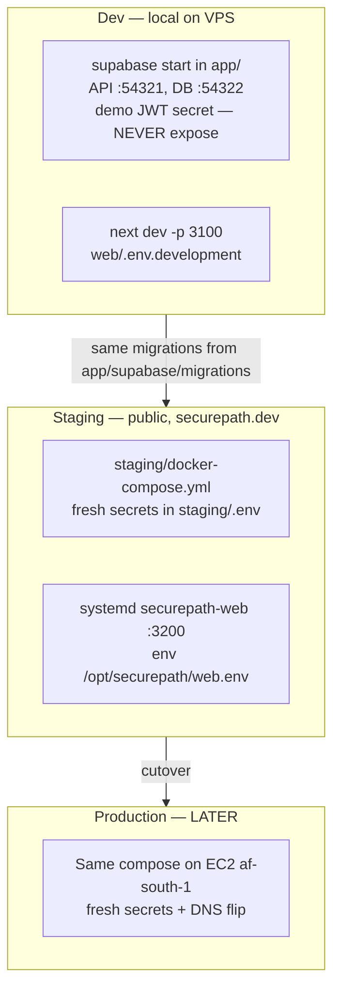
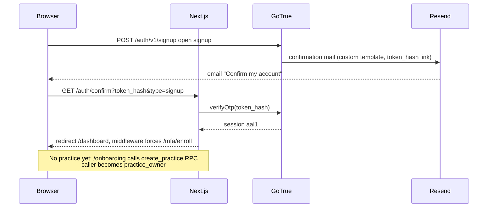
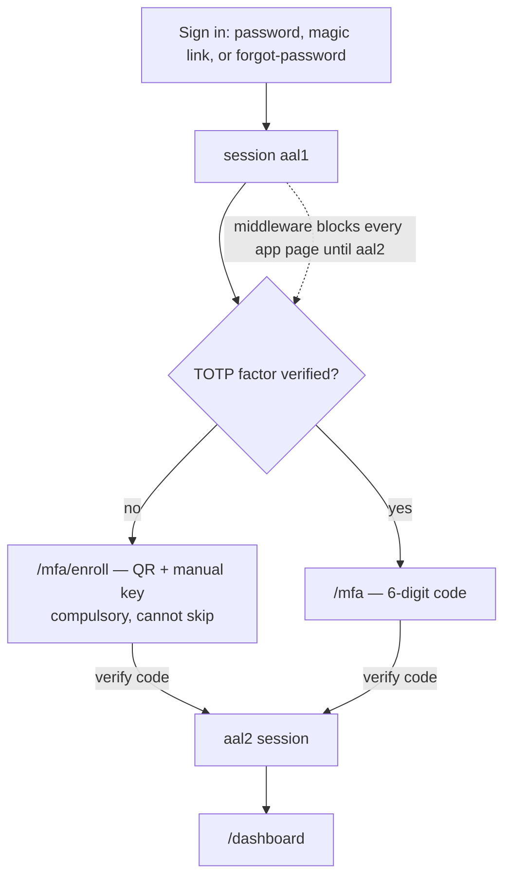
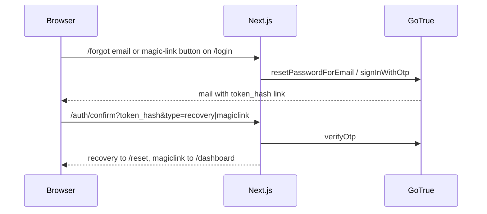
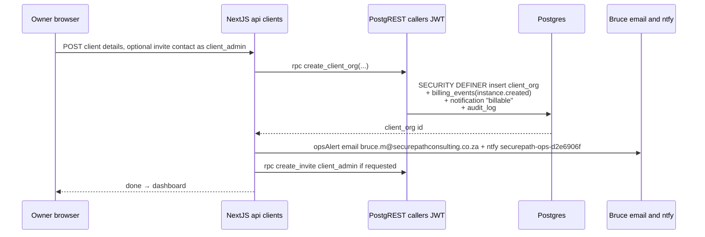
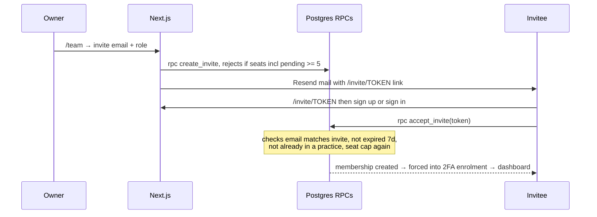

# SecurePath Privacy Platform — Working Doc / Handover

> **What this is:** POPIA/GDPR compliance SaaS for MSP resellers and their SMB clients. MSPs (called **practices**) sign up, whitelabel their workspace, invite up to 5 team members, and create **client instances** — each instance creation is a **billable event** (manual billing for now, ledger + alerts). Staging is LIVE at **https://securepath.dev**.
>
> "SecurePath" is a **placeholder name** — final name undecided. Working domain securepath.dev (Cloudflare).

## Status (2026-07-29)

| Piece | State |
|---|---|
| Multi-tenant foundation (RLS, 5 roles, GoTrue) | ✅ built + e2e-proven (22/22, 18/18 suites) |
| Staging at securepath.dev | ✅ LIVE — Next.js + lean self-hosted Supabase on the VPS |
| Auth: signup + confirm, login, forgot password, magic link | ✅ live, Resend mail |
| Compulsory TOTP 2FA (Google Authenticator etc.) | ✅ live, middleware-enforced |
| Client instances + billing ledger + ops alerts | ✅ live (manual billing) |
| 5-seat team invites, whitelabel branding | ✅ live |
| Production (AWS af-south-1), CI, product name, F2 assessment engine | ⏸ pushed back deliberately |

## System architecture


Key decisions:
- **No Kong** — Caddy path-routes the Supabase API on the same domain (`securepath.dev/auth/v1`, `/rest/v1`). One domain, no extra DNS.
- **Authorization lives entirely in Postgres RLS** keyed on `auth.uid()`. Tenant id never accepted from the client. App server calls RPCs **under the caller's JWT**, so RLS always applies.
- **SA data residency** is the compliance pitch → self-hosted Supabase, prod later in AWS af-south-1 (hosted Supabase has no SA region). No Clerk (US residency weakens pitch).

## Environments



- **Deploy web change:** `staging/deploy-web.sh` (builds `web/`, copies standalone to `/opt/securepath/web-dist`, restarts systemd).
- **Apply migration to staging:** psql as **supabase_admin** (not `postgres` — it can't alter reserved roles in the supabase image). Command in `staging/README.md`.
- `supabase db reset` broken in CLI 2.110 (LegacyDbBootstrapError) — apply dev migrations incrementally via psql :54322.

## Tenancy model


Roles: `practice_owner` (everything), `practice_consultant` (only *assigned* clients), `client_admin`/`client_contributor` (pinned to one client org), `read_only`. Seat cap of 5 counts consultants + read_only (owner and client-side users excluded), including pending invites.

RLS pattern for every future domain table: `client_org_id` column + 2 policies via `allowed_client_orgs()` — copy the `assessments` table.

## Auth flows

### Signup + email confirm



**Gotcha that burned us:** self-hosted GoTrue default mail links use `?token=` (its own GET-verify flow); the app verifies `?token_hash=`. Fixed with custom templates in `web/public/mail-templates/*.html`, fetched by GoTrue at send time via `GOTRUE_MAILER_TEMPLATES_*` (path `/mail-templates` is middleware-exempt). If mail links ever break again, check this first.

### Sign-in with compulsory 2FA



- Middleware (`web/middleware.ts`): no session → `/login`; aal1 with verified factor → `/mfa`; aal1 without → `/mfa/enroll`. Exempt: public pages, `/mfa*`, `/reset`, `/mail-templates`.
- **Ceiling:** enforcement is app-layer only — a direct REST call with an aal1 JWT still passes RLS. Add aal2 checks in RLS when hardening for prod.

### Forgot password / magic link



**Hard rule learned:** every server-side redirect/link must use `BASE_URL` (`web/lib/base-url.ts`, env `APP_URL`) — `req.url` behind Caddy is the internal host and produced `localhost:3200` redirects three separate times (confirm route, API invite links, middleware).

## Client instance creation — the billable event



- **Ledger is authoritative**, written in the same transaction as the client org. Alerts are best-effort extras.
- `billing_events` has **no RLS policies** — invisible to all app users. Read it for invoicing: psql as supabase_admin.
- Manual billing model (decision 2026-07-29): no Stripe yet; wire it against the ledger later.

## Team invites (5-seat cap)



## Whitelabel

Practice owner sets display name, logo URL, accent color at `/settings/branding` (columns on `practices`). Layout reads them per-request: nav brand + `--accent` CSS var swap → whole workspace and client-facing pages render the MSP's brand. In-app only for now; custom domains per MSP = later (Caddy on-demand TLS when justified).

## Mail

- Resend account: **verified domain is `mail.securepathconsulting.co.za`** (subdomain!). From = `noreply@mail.securepathconsulting.co.za` — root-domain from-address 403s.
- GoTrue auth mail via SMTP (`smtp.resend.com:587`, user `resend`, pass = API key, in `staging/.env`). App mail (invites, billing alerts) via Resend REST (`web/lib/mail.ts`, key in `/opt/securepath/web.env`).
- Resend refuses fake recipient domains (`example.com` → GoTrue 500 "Error sending confirmation email"). Tests: use `delivered@resend.dev`. Per-email rate limit ≈60s between auth mails.

## Security notes (verified, some the hard way)

- Staging containers + Next bind **127.0.0.1 only**; dev Supabase :54321/:54322 and web :3100/:3200 dropped at `iptables -t raw` on eth0. **Self-testing public ports from the VPS lies** (loops via `lo`, bypasses eth0 rules) — verify from a real external host.
- Dev CLI stack uses the **public demo JWT secret** — never expose :54321. Staging has fresh secrets (`staging/.env`, chmod 600).
- `audit_log` and `billing_events` are append-only (REVOKE UPDATE/DELETE).
- SELinux (EL10): systemd can't read files `mv`-ed from `/root` — `restorecon -R` after moving anything into `/opt/securepath`.

## Repo map

```
/root/securepath-privacy/
├── CLAUDE.md            ← this doc (also published as the artifact)
├── roadmap.html         ← phase-0 roadmap page (historical)
├── app/                 ← supabase project: migrations = source of truth for schema
│   ├── supabase/migrations/   1 tenancy+RLS · 2 grants · 3 billing/invites/onboarding
│   └── tests/e2e_isolation.py (22/22 CI gate)
├── web/                 ← Next.js 15 app (App Router, @supabase/ssr)
│   ├── app/             pages: login, signup, forgot, reset, mfa(+enroll), onboarding,
│   │                    dashboard, clients/new, team, notifications, settings/branding,
│   │                    invite/[token] · api: clients, invites · auth: confirm, signout
│   ├── lib/             supabase(-browser).ts, base-url.ts, mail.ts
│   └── public/mail-templates/  GoTrue mail templates (token_hash links)
├── staging/             ← compose + secrets + deploy-web.sh + README (runbook)
├── poc/                 ← original SQL isolation suite (18/18, reference)
└── docs/                ← product scope, MVP spec, data model, source xlsx sheets
```

## Roadmap — what's next (pushed-back list)

1. **F1 remainder:** audit CSV export, Entra ID SSO (WorkOS, narrowly).
2. **Infra:** real product name → domain; provision af-south-1 prod (runbook in `app/README.md`); CI running both isolation suites per migration.
3. **F2 assessment engine** — digitise the Excel POPIA/GDPR sheets (`docs/files.zip`), **exact score parity required**. Then F3–F9 per `roadmap.html`.
4. Prod hardening: aal2 in RLS, Stripe against `billing_events`, backups (WAL-G → S3 af-south-1, never cross-region).

North star: client-ready, evidence-linked monthly compliance report in <60 min advisor time. Goal for this phase: 3–5 design-partner clients under 1–2 advisor tenants.

## VPS: do not supabase start
On this host, `supabase start` is blocked (exit 99). Live SecurePath uses `/root/securepath-privacy/staging` docker compose only. Override only with `SUPABASE_ALLOW_START=1`. See DO-NOT-SUPABASE-START-ON-VPS.md.

## Conversational assessments

The grid assessment remains available at `/assessments/[id]`. The companion
conversation at `/assessments/[id]/chat` uses the server-side deterministic
engine and the existing `upsert_response` RPC, so scoring remains canonical
and Excel-parity is preserved. The append-only transcript is stored in
`assessment_chat_turns`; evidence metadata is stored in
`assessment_documents`, while evidence bytes remain on the VPS under
`ASSESSMENT_EVIDENCE_DIR` (default `/opt/securepath/evidence`) in
server-derived client/session paths.

OpenAI is an optional conversational provider. It uses only the Responses API
at `https://api.openai.com/v1/responses`, defaults to model `gpt-5.6-luna` and
reasoning effort `max`, and never receives uploaded document contents or
filenames. Environment variables are:

- `AI_PROVIDER` — `auto` (default; OpenAI when a key exists), `none`/`deterministic`,
  or `openai` (explicit provider selection).
- `OPENAI_API_KEY` — server-only OpenAI key; never commit or place in an example
  file.
- `OPENAI_MODEL` — defaults to `gpt-5.6-luna`.
- `OPENAI_REASONING_EFFORT` — defaults to `max`.
- `OPENAI_TIMEOUT_MS` — request timeout, default 30000.

Free-text model classifications are proposals only. A proposal is persisted in
the transcript and requires a visible user confirmation before the deterministic
engine writes a response. Missing keys, timeouts, API errors, and malformed
outputs fall back to deterministic conversation text. Model calls emit a
server-side diagnostic line containing model, status, latency, usage, and error
metadata only; prompts and completions are not logged.

OpenAI is a US sub-processor for this optional feature. Its processing,
cross-border transfer, contract, and security details must be included in the
customer's POPIA operator and cross-border disclosure.
