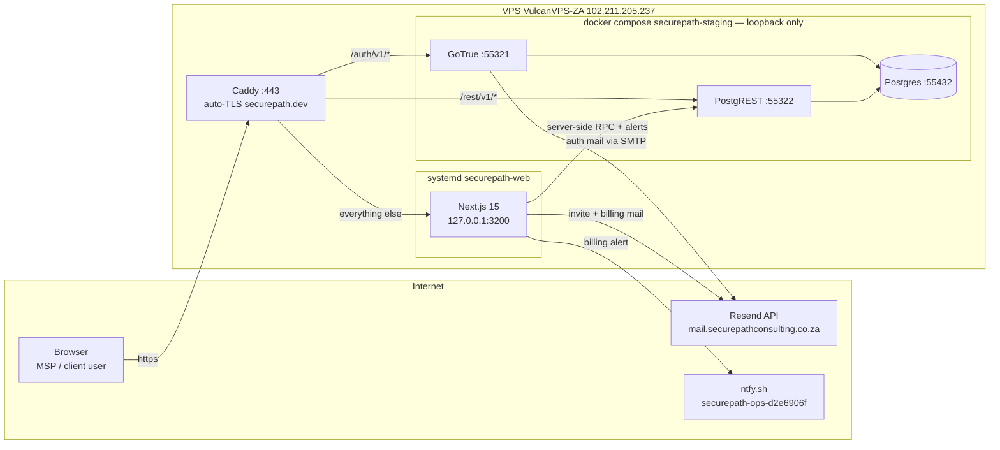
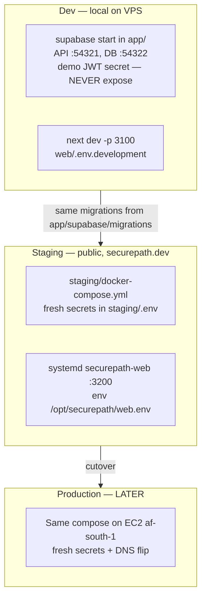
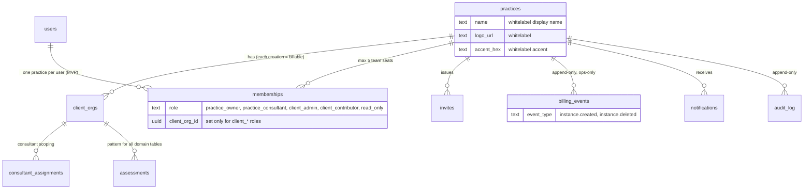
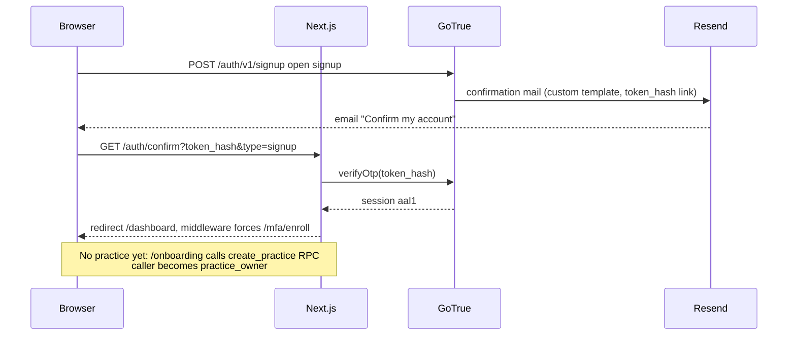
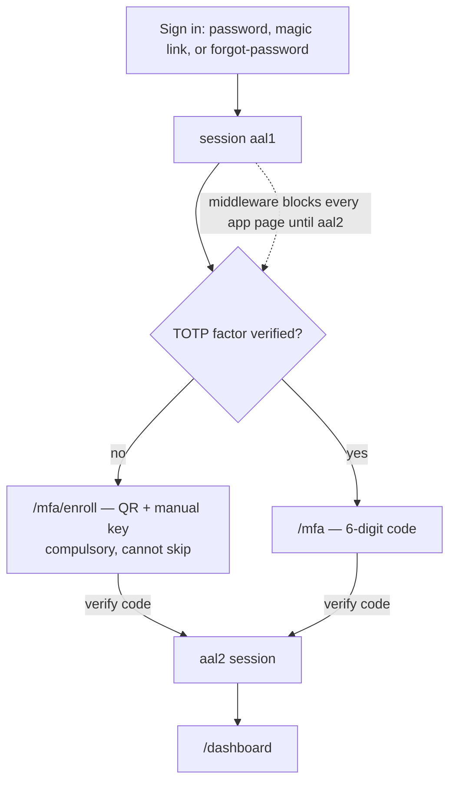
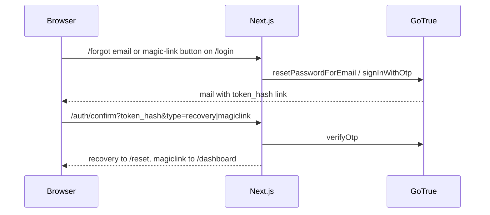
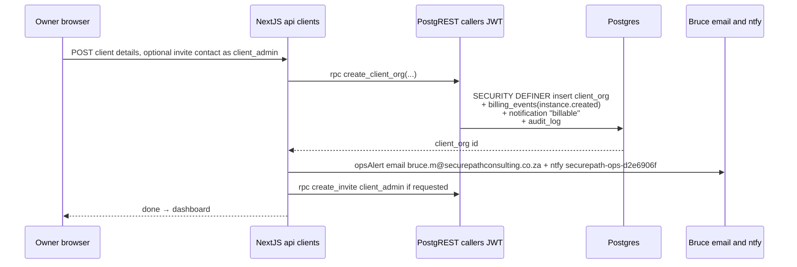
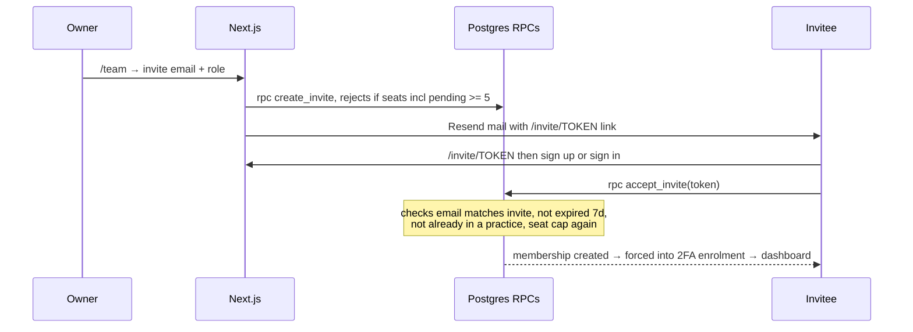
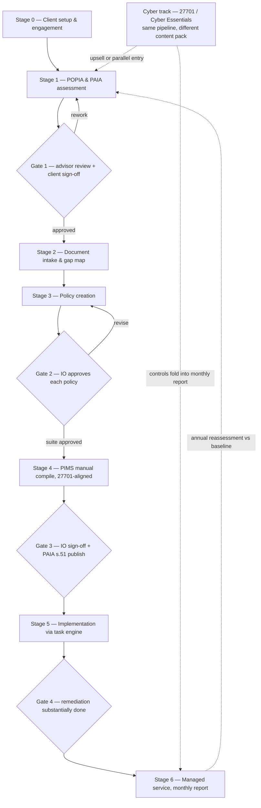
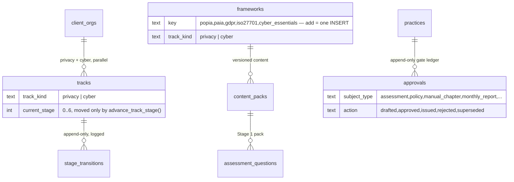

# SecurePath Privacy Platform — Working Doc / Handover

> **What this is:** POPIA/GDPR compliance SaaS for MSP resellers and their SMB clients. MSPs (called **practices**) sign up, whitelabel their workspace, invite up to 5 team members, and create **client instances** — each instance creation is a **billable event** (manual billing for now, ledger + alerts). Staging is LIVE at **https://securepath.dev**.
>
> "SecurePath" is a **placeholder name** — final name undecided. Working domain securepath.dev (Cloudflare).

## Status (2026-08-12)

| Piece | State |
|---|---|
| Multi-tenant foundation (RLS, 5 roles, GoTrue) | ✅ built + e2e-proven (22/22, 18/18 suites) |
| Staging at securepath.dev | ✅ LIVE — Next.js + lean self-hosted Supabase on the VPS |
| Auth: signup+confirm, login, forgot, magic link, compulsory TOTP 2FA | ✅ live, Resend mail |
| **Workflow spine** — tracks/stage state, content packs, approvals ledger | ✅ built + verified |
| **All 7 stages + 4 gates** (0→6, privacy track) | ✅ **built + e2e-verified on staging** |
| **Object storage** (MinIO → S3 af-south-1, portable) | ✅ live |
| **Acceptance test** — Cyber Essentials pack on the same screens | ✅ **PASSED** — next framework is content-only |
| CI — `.github/workflows/e2e.yml`, both suites per PR | ✅ written (verifies on first push; branch protection = one repo-settings click) |
| Production (AWS af-south-1), product name | ⏸ pushed back deliberately |

> **The product is a pipeline, and the whole pipeline is now built.** A client travels Stage 0→6 on the privacy (POPIA/PAIA) track, and the same screens render a second framework (Cyber Essentials) with zero code change. What remains is depth (fuller content, AI drafting, client-staff task pages), not new machinery — see *Roadmap*.

## System architecture



Key decisions:
- **No Kong** — Caddy path-routes the Supabase API on the same domain (`securepath.dev/auth/v1`, `/rest/v1`). One domain, no extra DNS.
- **Authorization lives entirely in Postgres RLS** keyed on `auth.uid()`. Tenant id never accepted from the client. App server calls RPCs **under the caller's JWT**, so RLS always applies.
- **SA data residency** is the compliance pitch → self-hosted Supabase, prod later in AWS af-south-1 (hosted Supabase has no SA region). No Clerk (US residency weakens pitch).

## Environments



- **Deploy web change:** `staging/deploy-web.sh` (builds `web/`, copies standalone to `/opt/securepath/web-dist`, restarts systemd).
- **Apply migration to staging:** psql as **supabase_admin** (not `postgres` — it can't alter reserved roles in the supabase image). Command in `staging/README.md`.
- `supabase db reset` broken in CLI 2.110 (LegacyDbBootstrapError) — apply dev migrations incrementally via psql :54322.

## Tenancy model



Roles: `practice_owner` (everything), `practice_consultant` (only *assigned* clients), `client_admin`/`client_contributor` (pinned to one client org), `read_only`. Seat cap of 5 counts consultants + read_only (owner and client-side users excluded), including pending invites.

RLS pattern for every future domain table: `client_org_id` column + 2 policies via `allowed_client_orgs()` — copy the `assessments` table.

## Auth flows

### Signup + email confirm



**Gotcha that burned us:** self-hosted GoTrue default mail links use `?token=` (its own GET-verify flow); the app verifies `?token_hash=`. Fixed with custom templates in `web/public/mail-templates/*.html`, fetched by GoTrue at send time via `GOTRUE_MAILER_TEMPLATES_*` (path `/mail-templates` is middleware-exempt). If mail links ever break again, check this first.

### Sign-in with compulsory 2FA



- Middleware (`web/middleware.ts`): no session → `/login`; aal1 with verified factor → `/mfa`; aal1 without → `/mfa/enroll`. Exempt: public pages, `/mfa*`, `/reset`, `/mail-templates`.
- **Ceiling:** enforcement is app-layer only — a direct REST call with an aal1 JWT still passes RLS. Add aal2 checks in RLS when hardening for prod.

### Forgot password / magic link



**Hard rule learned:** every server-side redirect/link must use `BASE_URL` (`web/lib/base-url.ts`, env `APP_URL`) — `req.url` behind Caddy is the internal host and produced `localhost:3200` redirects three separate times (confirm route, API invite links, middleware).

## Client instance creation — the billable event



- **Ledger is authoritative**, written in the same transaction as the client org. Alerts are best-effort extras.
- `billing_events` has **no RLS policies** — invisible to all app users. Read it for invoicing: psql as supabase_admin.
- Manual billing model (decision 2026-07-29): no Stripe yet; wire it against the ledger later.

## Team invites (5-seat cap)



## Whitelabel

Practice owner sets display name, logo URL, accent color at `/settings/branding` (columns on `practices`). Layout reads them per-request: nav brand + `--accent` CSS var swap → whole workspace and client-facing pages render the MSP's brand. In-app only for now; custom domains per MSP = later (Caddy on-demand TLS when justified).

## Product workflow — Assessment to Management (spec v1.0, William)

The product is **one pipeline** a client travels once and then loops on monthly. Two tracks share it: **privacy** (POPIA & PAIA, built first) proves the pattern; **cyber** (ISO 27701, Cyber Essentials) reuses the *same machinery* with a different content pack. Seven stages, four human approval gates — nothing passes a gate automatically.



**The load-bearing rule — content-driven screens.** Question sets, document checklists, templates, manual outlines are **content packs**, versioned at practice level. The frontend *renders* content, it does not *encode* it. Acceptance test for every screen: *does it work unchanged when the framework changes?* If a new framework needs a code change, the architecture failed.

Other cross-cutting rules (all spec §6):
- **Explicit stage state** — every transition is explicit and logged; a stage never advances as a side effect.
- **Draft (AI) vs Approved** — nothing AI-drafted (summaries, policies, chapters, report narratives, letters) is client-visible or issuable without a *logged human approval*. The UI must distinguish Draft(AI) from Approved everywhere.
- **Evidence immutability** — uploads, task completions, sign-offs, issued docs are immutable; corrections are new versions, never edits.
- **The baseline runs through everything** — the Stage 1 score anchors the whole relationship: the implementation board closes gaps against it, the monthly report shows movement against it, the annual reassessment renews against it.

### The spine (what makes the above true)

Migration `app/supabase/migrations/20260810000002_workflow_spine.sql`. Three primitives every stage hangs off — build stages *on* these, never bespoke:



- **(a) Tracks + stage state** — `tracks` (one privacy + one cyber per client, run in parallel), `current_stage` 0–6, moved **only** by `advance_track_stage()` which writes an append-only `stage_transitions` row. That RPC is the whole "explicit, logged, never a side effect" rule.
- **(b) Content packs** — `frameworks` registry + `content_packs` (versioned, practice-scopable) **replaced Devin's `CHECK(framework IN …)` enum**. Adding a framework is one `INSERT`, zero schema change (the acceptance test, in the DB). Scoring RPCs join on the framework text (now FK-backed) → unchanged, parity preserved. The 89 Stage-1 questions were migrated onto packs.
- **(c) Draft/Approved + evidence** — `approval_status` domain (`draft_ai|draft_human|approved|issued|superseded`) reused by every future artifact table; append-only `approvals` ledger via `record_approval()`. Stage 1's gate is the first consumer (`assessment_sessions.approval_status`).

Every spine RPC (`create_track`, `advance_track_stage`, `record_approval`) guards `allowed_client_orgs()` / `current_practice()` explicitly — a SECURITY DEFINER owned by a superuser bypasses RLS, so the check must be in the function body (learned the hard way, see below).

### Pipeline stages — all built (2026-08-11/12)

Every stage rides the spine; every RPC guards `allowed_client_orgs()`; every artifact carries `approval_status`; issued docs are immutable evidence. Migrations `20260810000003`…`20260811000007` + `20260812000001/2`.

| Stage / Gate | Content pack | Key tables · RPCs | Screen |
|---|---|---|---|
| **2** Document intake & gap map | `document_checklists` (31 POPIA slots) | `documents` (immutable), `document_links` · `record_document`, `set_document_link` | `/clients/[id]/documents` — bulk upload, auto-proposed slot, gap map |
| **Gate 1** assessment sign-off | — | `sign_off_assessment` (baseline; advance to 2) | on the assessment page |
| **3** Policy workbench | `policy_templates` | `policies` · `create_policy`, `update_policy_draft`, `approve_policy`, `issue_policy` | `/clients/[id]/policies` — draft→approve→**issue closes the gap** |
| **Gate 2** policy suite approved | — | `advance_track_stage` → 4 | policies page |
| **4** PIMS manual (27701-aligned) | `manual_outlines` (13 chapters, clause refs) | `manuals` · `record_manual`, `sign_off_manual` | `/clients/[id]/manual` — compile-from-registers |
| **Gate 3** IO sign-off + PAIA s.51 | — | `sign_off_manual` → issue + advance to 5 | manual page |
| **5** Implementation board | `task_templates` (18 POPIA tasks) | `tasks` · `generate_remediation_plan`, `update_task` | `/clients/[id]/tasks` — themed board, progress vs baseline |
| **Gate 4** remediation done | — | `advance_track_stage` → 6 (all critical+high done) | tasks page |
| **6** Monthly report studio | — (baseline + progress) | `monthly_reports` · `record_monthly_report`, `issue_monthly_report` | `/clients/[id]/report` — movement vs baseline, approve-and-issue, archive |

**Object storage.** Document bytes live in S3-compatible storage — MinIO on staging, AWS S3 af-south-1 at prod, swapped by env (`S3_*`), zero code change. Uploads/downloads go **server-side through Next** (`web/lib/storage.ts`, `/api/documents`), which enforces `allowed_client_orgs()` before touching bytes; downloads stream through the server (not presigned) so the bucket is never public. Issued policies/manuals/reports are rendered to storage as immutable evidence documents.

**Acceptance test — PASSED (2026-08-12).** Activated a **Cyber Essentials** content pack (`20260812000001`) — all content, zero schema change (10 questions, 8 checklist slots, 2 policy templates, 6 manual chapters, 8 tasks). The screens had one shortcut (framework hardcoded `popia` in 6 spots); fixed by threading a `?framework` param + a framework arg on `generate_remediation_plan` (`20260812000002`) — ~80 lines, all parameter-passing, no component rewrites, **one-time**. The same screens now render CE content end-to-end (tasks land on a parallel **cyber** track); POPIA unchanged. **The next framework is pure content — INSERTs, zero code.** The content-driven architecture is proven.

## Mail

- Resend account: **verified domain is `mail.securepathconsulting.co.za`** (subdomain!). From = `noreply@mail.securepathconsulting.co.za` — root-domain from-address 403s.
- GoTrue auth mail via SMTP (`smtp.resend.com:587`, user `resend`, pass = API key, in `staging/.env`). App mail (invites, billing alerts) via Resend REST (`web/lib/mail.ts`, key in `/opt/securepath/web.env`).
- Resend refuses fake recipient domains (`example.com` → GoTrue 500 "Error sending confirmation email"). Tests: use `delivered@resend.dev`. Per-email rate limit ≈60s between auth mails.

## Security notes (verified, some the hard way)

- Staging containers + Next bind **127.0.0.1 only**; dev Supabase :54321/:54322 and web :3100/:3200 dropped at `iptables -t raw` on eth0. **Self-testing public ports from the VPS lies** (loops via `lo`, bypasses eth0 rules) — verify from a real external host.
- Dev CLI stack uses the **public demo JWT secret** — never expose :54321. Staging has fresh secrets (`staging/.env`, chmod 600).
- `audit_log`, `billing_events`, `stage_transitions`, `approvals` are append-only (REVOKE UPDATE/DELETE).
- SELinux (EL10): systemd can't read files `mv`-ed from `/root` — `restorecon -R` after moving anything into `/opt/securepath`.
- **SECURITY DEFINER owned by a superuser bypasses RLS** — the "RLS enforces access" comment is a lie inside a definer. Every such RPC touching tenant data MUST call `allowed_client_orgs()`/`current_practice()` in its body. Confirmed cross-tenant write on staging from Devin's assessment RPCs before this was fixed (`20260810000001_fix_assessment_rpc_authz.sql`).

## Repo map

```
/root/securepath-privacy/
├── CLAUDE.md            ← this doc (also published as the artifact)
├── roadmap.html         ← phase-0 roadmap page (historical)
├── app/                 ← supabase project: migrations = source of truth for schema
│   ├── supabase/migrations/   1 tenancy+RLS · 2 grants · 3 billing/invites/onboarding
│   │                    · 20260806* assessment engine + 8 POPIA modules (Stage 1, Devin)
│   │                    · 20260807* scoring parity / batch / validation fixes (Devin)
│   │                    · 20260810000001 assessment RPC authz fix (cross-tenant hole)
│   │                    · 20260810000002 workflow spine (tracks, content packs, approvals)
│   │                    · 20260810000003 Stage 2 · ...0004 real POPIA checklist
│   │                    · 20260811000001 gate1 · 0002 Stage3 · 0003 issue+gate2
│   │                    · 20260811000004 Stage4 · 0005 Stage5 · 0006 Stage6
│   │                    · 20260812000001 Cyber Essentials pack · 0002 framework-parameterize
│   │                    · 20260812000003 track correctness (tracks@stage0, cyber Gate 1,
│   │                      baseline snapshot, registry-driven dropdown)
│   │                    · 20260813* content depth: policy library (26 POPIA templates) ·
│   │                      tiered task library (108) · CE bank (88q) · GDPR pack (77q)
│   └── tests/e2e_isolation.py (22/22 CI gate)
├── web/                 ← Next.js 15 app (App Router, @supabase/ssr)
│   ├── app/             auth pages (login/signup/forgot/reset/mfa/onboarding), dashboard,
│   │                    clients/new, team, notifications, settings/branding, invite/[token],
│   │                    assessments (Stage 1) · clients/[id]/{documents,policies,manual,tasks,report}
│   │                    (Stages 2–6, all take ?framework) · api: clients, invites, assessments,
│   │                    documents, policies, manuals, reports · auth
│   ├── lib/             supabase(-browser).ts, base-url.ts, mail.ts, storage.ts (S3), classify.ts
│   └── public/mail-templates/  GoTrue mail templates (token_hash links)
├── staging/             ← compose + secrets + deploy-web.sh + README (runbook)
├── poc/                 ← original SQL isolation suite (18/18, reference)
└── docs/                ← product scope, MVP spec, data model, source xlsx sheets
```

## Roadmap — what's next

**The pipeline is built (Stages 0–6, both gates, two frameworks proven).** What remains is depth on the same machinery — no new architecture:

- **Fuller content packs — DONE 2026-08-12** (`20260813000001–4`): 26 POPIA policy templates (PIM Generator), 108-task tiered remediation library (`task_templates.tier`; UI headcount filter still TODO), 88-question CE bank, 77-question GDPR pack. Remaining content work: William confirms the 31-slot checklist; PAIA/ISO 27701 packs (registered, no content); scoring-parity test vs the source xlsx; missing POPIA prototype from OneDrive.
- **AI drafting / narrative** (Stages 3 & 6): replace template-fill and the templated report narrative with real drafts. **Use Claude (Anthropic API)** per platform guidance — not the OpenAI adapter on Devin's branch. Needs an API key.
- **Client-staff task pages** (Stage 5): magic-link task pages (token like invites, no full login) + per-task evidence upload (`tasks.evidence_document_id` already exists).
- **Cross-client practice console** (Stage 6 spec): month-status-per-client overview, overdue flags, report pipeline.
- **Annual reassessment loop** (Stage 6 → 1): delta report vs baseline feeding renewal.
- ~~**Track/stage polish**~~ **DONE 2026-08-12** (`20260812000003`): both tracks created at Stage 0 (client creation), assessment start logs 0→1, Gate 1 logs 1→2, cyber assessments sign off their own track, baseline snapshotted immutably onto the track.

**Deferred infra (pushed back deliberately):** real product name → domain; af-south-1 prod (runbook `app/README.md`); CI running both isolation suites per migration; Entra ID SSO (WorkOS); prod hardening (aal2 in RLS, Stripe against `billing_events`, WAL-G backups → S3 af-south-1); two unmerged Devin branches on GitHub (AI chat-assessment mode reviewed & safe pending base fix + 2 nits; testing skill).

North star: client-ready, evidence-linked monthly compliance report in <60 min advisor time. Goal for this phase: 3–5 design-partner clients under 1–2 advisor tenants.

## VPS: do not supabase start
On this host, `supabase start` is blocked (exit 99). Live SecurePath uses `/root/securepath-privacy/staging` docker compose only. Override only with `SUPABASE_ALLOW_START=1`. See DO-NOT-SUPABASE-START-ON-VPS.md.
